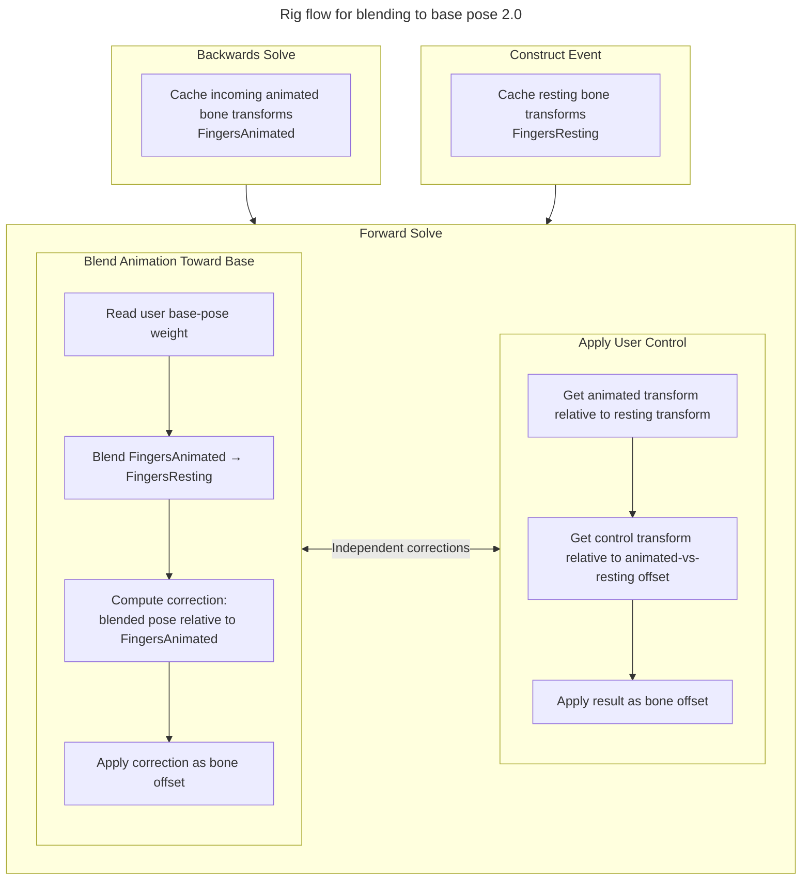

## Requirements
The "Toucan" Picker and Rig build upon the Picker and Rig made by CC. They control Character Creator characters from Reallusion. Therefore you will need the plugins from Reallusion (you can use the auto plugin for example).

The Picker also uses functions from the SequencerAbstraction repo: https://github.com/J-Andersen-UvA/sequencerAbstraction

## Functionalities
Besides the present functionalities from the CC Rig and Picker, the Toucan version Picker adds:
- A more compact picker
- The ability to shift/ctrl click the picker (so you can multi-select and deselect)
- Zeroing keyframe shortcut
- ReKey shortcut
- Finger and body control visualize option that removes old keys where necessary
- LookAt offset selector
- Ability to see what values are altered at the current playhead time for the rig
- Buttons to quickly move camera to set angles of the hand
- Additional picker assets for faster access to specialized control sets:
  - `Toucan_CC_Mouthing_Picker` for blending to Oral Components and shaping mouth poses
  - `Toucan_CC_Tongue_Picker` for moving tongue controls directly
  - `Toucan_CC_Selection_Tool` for easier selection of Forward Control Rig controls

The version of the Toucan Rig adds:
- LookAt offset for eyebones
- Hands separated from the body for show bool
- Default to IK
- Mapped curve helpers for blending oral components into jaw, mouth, and tongue control values

## Blend to base pose
Blending the animation back to the base pose deserves extra attention in this readme. Here is the flow inside the control rig that manages the return to the base pose.
